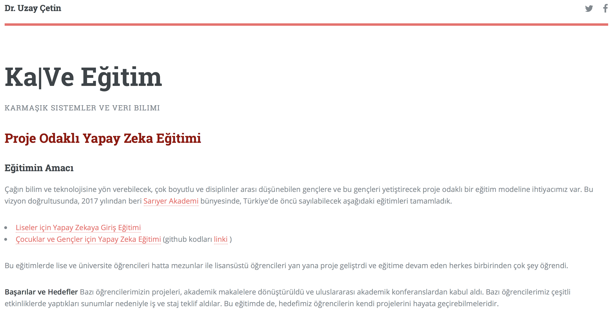

    

   

  

<h2>
										 
										Proje Odaklı Yapay Zeka Eğitimi
										 </h2>

										<h3> Eğitimin Amacı</h3>
										
 Çağın bilim ve teknolojisine yön verebilecek, çok boyutlu ve disiplinler arası düşünebilen gençlere ve bu gençleri yetiştirecek proje odaklı bir eğitim modeline ihtiyacımız var. 	
										Bu vizyon doğrultusunda,	
										2017 yılından beri
										<a href="http://sariyerakademi.com">Sarıyer Akademi</a>  bünyesinde,
										Türkiye'de öncü sayılabilecek aşağıdaki eğitimleri tamamladık.

										<ul>
											<li>
												<a href="https://uzay00.github.io/kahve/giris.html">Liseler için Yapay Zekaya Giriş Eğitimi</a>
											</li>
											<li>
												<a href="https://uzay00.github.io/kahve/orta.html">Çocuklar ve Gençler için Yapay Zeka Eğitimi</a> (github kodları 
												<a href="https://github.com/uzay00/KaVe">
												linki</a> )
											</li>
										</ul>
										Bu eğitimlerde lise ve üniversite öğrencileri hatta mezunlar ile lisansüstü öğrencileri yan yana proje geliştrdi ve eğitime devam eden herkes birbirinden çok şey öğrendi.
										

										

										
										

										<strong> Başarılar ve Hedefler</strong>
										Bazı öğrencilerimizin projeleri, akademik makalelere dönüştürüldü ve uluslararası akademik konferanslardan kabul aldı.
										Bazı öğrencilerimiz çeşitli etkinliklerde yaptıkları sunumlar nedeniyle iş ve staj teklif aldılar. Bu eğitimde de, hedefimiz öğrencilerin kendi projelerini hayata geçirebilmeleridir.

										
										

										<h3> Katılımcılardan Beklentilerimiz</h3>
										
 <strong> Devam Gerekliliği</strong> Bilindiği gibi yapay zeka herkesin merakını cezbeden ama ciddi emek göstermeyen hiç kimsenin başarı elde edemeyeceği bir konudur.  Katılımcılardan ricamız, eğer kendinizde uzun soluklu ve emek isteyen bir araştırma sürecini yürütecek gücü göremiyorsanız bu eğitime <strong>başvurmayınız</strong>.

										
										
<strong> Programlama Bilgisi Gerekliliği</strong> Python dili ile programlama daha önce yapmamış olabilirsiniz. Sizden bu konuda kendinizi geliştirmenizi bekliyoruz. Eğer Python öğrenmek için emek vermeyecekseniz, bu eğitime <strong>başvurmayınız</strong>. Unutmayınız ki, bu bir programlamaya giriş eğitimi değil, proje odaklı bir yapay zeka eğitimidir. Eğitime gelmeden önce, bilgisayarınıza <a href="https://www.anaconda.com/distribution/"> Anaconda</a> dağıtımını yükleyiniz. Böylece tüm gereken python paketleri bilgisayarınıza otomatik olarak yüklenecektir. (Eğer paketleri tek tek kendiniz yüklemek isterseniz,
												<a href="https://www.python.org/downloads/windows/">
												Python 
												</a> ve 
												<a href="http://jupyter.readthedocs.io/en/latest/install.html#alternative-for-experienced-python-users-installing-jupyter-with-pip">
												Jupyter Notebok 
												</a> ve Numpy, SciPy, Scikit-learn, Pandas, Matplotlib, NetworkX ve NLTK paketlerini yükleyiniz.)
										

										
										
										<h3> Başvuru Koşulları</h3>
										
 Sarıyer Belediyesi Kültür Eğitim Destek Merkezi 
										tarafından desteklenen bu programa katılım için aday öğrencilerin aşağıdaki anketi doldurmaları gerekmektedir. 
										Verdikleri bilgilere göre seçilecek 20 katılımcı kendi bilgisayarları ile <a href="http://sariyerakademi.com">Sarıyer Akademi</a> bünyesinde 
										bu eğitim programından yararlanacaklardır. 
										Hedef kitlemiz, öncelikli olarak, 15-29 yaş aralığındaki gençlerdir. 
										

										
<strong> Eğitim yeri ve zamanı</strong> Eğitim
										Sarıyer Belediyesi Yaşar Kemal Kültür Merkezi’nde
										perşembe günleri saat 16:30 - 20:00 arasında gerçekleşecektir.
										Katılımcıların 16 haftalık eğitimin tümüne katılmaları gerekmektedir.
										<strong> Eğitim ücretsizdir.</strong> 

										<h5>Anket</h5>
										Aşağıdaki ankette sizden bazı bilgilerinizi girmenizi isteyeceğiz, proje önerinizi ve bu eğitime katılmak için motivasyonunuzun ne olduğunu soracağız. Ama öncelikle size soracağımız yapay zeka ile ilgili 10 basit sorudan en az üçünü cevaplamanızı isteyeceğiz. Cevaplarınızı pdf halinde yüklemenizi rica edeceğiz. Hazırsanız, anketimizi doldurmaya başlayablirsiniz.
										  

										<ul class="actions">
										<li>
												<a href="https://goo.gl/forms/mAt2dMdPGgXESYun2" class="button">Anketi doldurunuz.</a>
											</li>
										</ul>
										